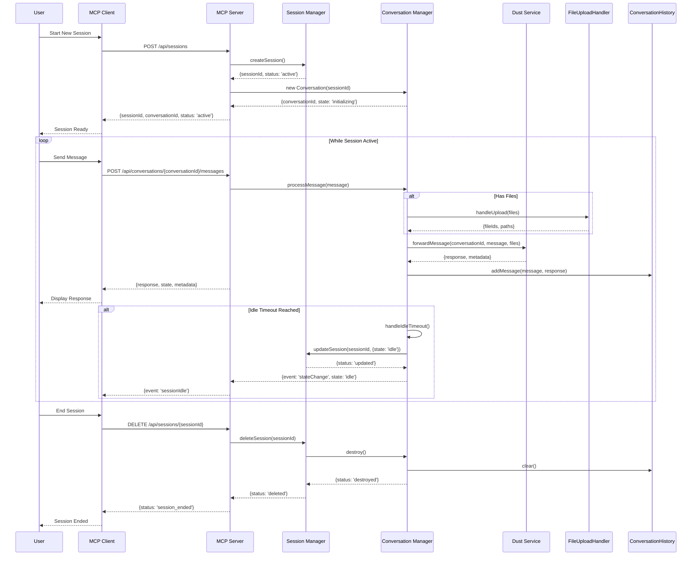

# Dust MCP Server

🚀 A TypeScript-based MCP (Model Context Protocol) Server with advanced agent conversation features.

**GitHub Repository:** [dust-mcp-server-postman-railway](https://github.com/ma3u/dust-mcp-server-postman-railway)

## Table of Contents

- [User Manual](#user-manual)
  - [Features](#features)
  - [Getting Started](#getting-started)
  - [Quick Start](#quick-start)
  - [Configuration](#configuration)
  - [Troubleshooting](#troubleshooting)
- [Developer Manual](#developer-manual)
  - [Architecture](#architecture)
  - [Agent Conversation Flow](#agent-conversation-flow)
  - [API Documentation](#api-documentation)
  - [Development Setup](#development-setup)
  - [Testing](#testing)
  - [Deployment](#deployment)

## User Manual

### Features

- ✅ TypeScript-powered MCP server
- 🏗️ Modern ES2022+ JavaScript features
- 🔍 Built-in API documentation
- 🧪 Comprehensive test suite with Jest
- 🛠️ Developer-friendly tooling
- 🔄 Hot-reloading development server
- 📦 Module aliases for clean imports
- 🔒 Environment-based configuration
- 🧩 Extensible architecture

## 🚀 Getting Started

### ⚙️ Prerequisites

Before you begin, ensure you have the following installed:

- [Node.js](https://nodejs.org/) (v18+ required, v20+ recommended)
- [npm](https://www.npmjs.com/) (included with Node.js)
- [TypeScript](https://www.typescriptlang.org/) (included as a dev dependency)
- [Git](https://git-scm.com/) (for version control)

### 🛠️ Installation

1. **Clone the repository**

   ```bash
   git clone https://github.com/ma3u/dust-mcp-server-postman-railway.git
   cd dust-mcp-server-postman-railway
   ```

2. **Install dependencies**

   ```bash
   npm install
   ```

3. **Set up environment variables**

   Create a `.env` file in the root directory with the following variables:

   ```env
   PORT=3000
   NODE_ENV=development
   DEFAULT_WORKSPACE_ID=default
   WORKSPACE_DEFAULT_API_KEY=your_api_key_here
   WORKSPACE_DEFAULT_NAME=Default Workspace
   ```

### 🏗️ Development

1. **Start the development server**

   ```bash
   npm run dev
   ```

   This will start the server with hot-reloading enabled.

2. **Build for production**

   ```bash
   npm run build
   npm start
   ```

3. **Run tests**

   ```bash
   npm test        # Run all tests
   npm run test:watch  # Run tests in watch mode
   npm run test:coverage  # Generate test coverage report
   ```

4. **Linting and Formatting**

   ```bash
   npm run lint     # Check for linting errors
   npm run lint:fix # Automatically fix linting issues
   npm run format   # Format code using Prettier
   ```

## Developer Manual

### Architecture
[Architecture overview]

### Agent Conversation Flow

The following diagram illustrates the conversation flow between MCP Client, MCP Server, and Dust with session management:



### API Documentation

The following API endpoints are available in the application:

### Health Check

```http
GET /health
```

Check if the server is running.

**Response:**

```json
{
  "status": "ok"
}
```

### Workspace Agent Configurations

```http
GET /api/workspaces/:workspaceId/agents
```

Get all agent configurations for a workspace.

**Parameters:**

- `workspaceId` (path, required): The ID of the workspace
- `forceRefresh` (query, optional): Force refresh the agent configurations (true/false)

**Response:**

```json
{
  "agents": [
    {
      "id": "agent1",
      "name": "Agent One",
      "description": "First agent",
      "config": {}
    }
  ]
}
```

### Get Specific Agent

```http
GET /api/workspaces/:workspaceId/agents/:agentId
```

Get configuration for a specific agent.

**Parameters:**

- `workspaceId` (path, required): The ID of the workspace
- `agentId` (path, required): The ID of the agent

**Response:**

```json
{
  "id": "agent1",
  "name": "Agent One",
  "description": "First agent",
  "config": {}
}
```

## 🛠 Environment Variables

The application uses the following environment variables:

| Variable | Required | Default | Description |
|----------|----------|---------|-------------|
| `PORT` | No | `3000` | Port to run the server on |
| `NODE_ENV` | No | `development` | Application environment |
| `DEFAULT_WORKSPACE_ID` | No | `default` | Default workspace ID |
| `WORKSPACE_<ID>_API_KEY` | Yes | - | API key for the workspace |
| `WORKSPACE_<ID>_NAME` | No | Workspace ID | Display name for the workspace |

## 🤝 Contributing

Contributions are welcome! Please follow these steps:

1. Fork the repository
2. Create a feature branch (`git checkout -b feature/AmazingFeature`)
3. Commit your changes (`git commit -m 'Add some AmazingFeature'`)
4. Push to the branch (`git push origin feature/AmazingFeature`)
5. Open a Pull Request

## 📝 License

This project is licensed under the MIT License - see the [LICENSE](LICENSE) file for details.

## 🙏 Acknowledgments

- Built with TypeScript and Node.js
- Uses Express for the web server
- Implements the Model Context Protocol (MCP) specification

## 📡 JSON-RPC Interface

The server supports the Model Context Protocol (MCP) via JSON-RPC 2.0 over HTTP.

### Discovering Available Tools

To list all available tools, send a `mcp_discover` request:

```bash
curl -X POST http://localhost:3000 \
  -H "Content-Type: application/json" \
  -d '{
    "jsonrpc": "2.0",
    "id": 1,
    "method": "mcp_discover",
    "params": {}
  }'
```

### Calling a Tool

To call a specific tool, such as `list_assistants`:

```bash
curl -X POST http://localhost:3000 \
  -H "Content-Type: application/json" \
  -d '{
    "jsonrpc": "2.0",
    "id": 2,
    "method": "list_assistants",
    "params": {}
  }'
```

### Prerequisites

Ensure you have `curl` installed. For testing with `netcat` (`nc`), install it using:

- **macOS**: `brew install netcat`
- **Ubuntu/Debian**: `sudo apt-get install netcat`

## 🔐 Tool Environment Variables

This project uses a `.env` file to manage environment-specific variables, such as API keys. To get started:

1. **Create your environment file**: Copy the example environment file to a new file named `.env`:

   ```sh
   cp .env.example .env
   ```

2. **Update API Keys**: Open the newly created `.env` file. You'll see placeholder environment variables for the Dust API:

   ```env
   DUST_API_KEY=
   DUST_WORKSPACE_ID=
   DUST_AGENT_ID=
   ```

   Update these lines with your actual Dust API Key, Workspace ID, and Agent ID. These environment variables are used by the tools to interact with the Dust API. You can inspect the files in the `tools` directory to see how they are used.

```javascript
// environment variables are used inside of each tool file
const apiKey = process.env.DUST_API_KEY;
const workspaceId = process.env.DUST_WORKSPACE_ID;
// etc.
```

**Note:** The generated tools will need to be configured to use these specific environment variables (`DUST_API_KEY`, `DUST_WORKSPACE_ID`, `DUST_AGENT_ID`). If the tools were generated for a different API or expect different environment variable names, you will need to manually update the JavaScript files in the `tools/` directory to use these variables correctly for authentication and API calls.

## Testing with Postman

Postman provides a user-friendly interface to test your MCP server. Follow these steps to get started:

### Prerequisites for Postman

- Install the latest [Postman Desktop Application](https://www.postman.com/downloads/)
- Node.js v18+ installed
- Your MCP server project dependencies installed (`npm install`)

## Creating a New MCP Request

1. Open Postman
1. Click "New" > "MCP Request"
1. In the new tab, you'll see the MCP request configuration

## Configuring the MCP Server

1. Set the request type to `STDIO`
2. In the command field, enter the full path to Node.js followed by the full path to `mcpServer.js`:

   ```sh
   /Users/ma3u/.nvm/versions/node/v22.14.0/bin/node /Users/ma3u/projects/postman-dust-mcp-server/mcpServer.js
   ```

   To find these paths on your system:

   ```bash
# Get Node.js path
which node
   
# Get absolute path to mcpServer.js (run from your project directory)
pwd
# Then append "/mcpServer.js" to the output
```

## Starting the Server

1. Click the "Connect" button in Postman
2. You should see the server start up in the terminal at the bottom of the screen
3. Once connected, you'll see a list of available tools in the response section

## Testing Tools

1. In the request body, enter a JSON-RPC request. For example, to list assistants:

   ```json
   {
     "jsonrpc": "2.0",
     "id": 1,
     "method": "list_assistants",
     "params": {}
   }
   ```

2. Click "Send" to execute the request
3. View the response in the lower panel

## Available Tools

You can call any of the following tools directly by name in the `method` field:

- `list_workspace_vaults` - List all workspace vaults
- `list_assistants` - List available assistants
- `list_data_source_views` - List data source views
- `get_conversation_events` - Get conversation events
- `get_data_sources` - Get available data sources
- `search_assistants_by_name` - Search for assistants by name
- `get_conversation` - Get conversation details
- `retrieve_document` - Retrieve a document
- `get_app_run` - Get application run details
- `get_events_for_message` - Get events for a specific message
- `upsert_document` - Create or update a document
- `get_documents` - Get multiple documents
- `create_conversation` - Start a new conversation
- `create_message` - Send a message
- `create_content_fragment` - Create a content fragment
- `create_app_run` - Start a new application run
- `search_data_source` - Search within a data source
- `search_data_source_view` - Search within a data source view

## Troubleshooting

### Common Issues and Solutions

1. **Server Not Starting**
   - Verify Node.js is installed and in your PATH
   - Check that all dependencies are installed (`npm install`)
   - Look for error messages in the Postman Notifications tab

2. **Connection Timeouts**
   - Ensure the server is running before making requests
   - Try restarting the server if it becomes unresponsive
   - Check that no other process is using the required port

3. **Invalid Method Errors**
   - Use tool names exactly as listed in the "Available Tools" section
   - Don't add prefixes like `mcp.` or `rpc.` to method names
   - Ensure the `params` field is an empty object `{}`

4. **Environment Variables**
   - Verify `.env` file exists and contains required variables
   - Ensure environment variables are properly loaded
   - Check for typos in variable names

5. **Server Logs**
   - Check the Postman Notifications tab for server output
   - Look for error messages or stack traces
   - The server logs all incoming requests and errors

### Restarting the Server

If you encounter issues, try these steps:

1. Click the "Disconnect" button in Postman
2. Wait a few seconds
3. Click "Connect" to restart the server
4. Try your request again

### Node Version Issues

- Make sure you're using Node.js v18 or higher
- You can specify the full path to a specific Node.js version if needed
- If using nvm, ensure you're using the correct Node.js version:
  ```sh
  nvm use 18  # or your preferred version
  ```

### Tool Execution Errors

- Check the Postman console for detailed error messages
- Verify that all required parameters are included in your request

## Example: Listing Data Sources

Here's how to list all data sources:

```json
{
  "jsonrpc": "2.0",
  "id": 2,
  "method": "list_data_sources",
  "params": {}
}
```

## Next Steps

Once you've verified the server works in Postman, you can integrate it with other MCP clients like Claude Desktop.

```sh
realpath mcpServer.js
```

Use the node command followed by the full path to `mcpServer.js` as the command for your new Postman MCP Request. Then click the **Connect** button. You should see a list of tools that you selected before generating the server. You can test that each tool works here before connecting the MCP server to an LLM.

## 👩‍💻 Connect the MCP Server to Claude

You can connect your MCP server to any MCP client. Here we provide instructions for connecting it to Claude Desktop.

**Step 1**: Note the full path to node and the `mcpServer.js` from the previous step.

**Step 2**. Open Claude Desktop → **Settings** → **Developers** → **Edit Config** and add a new MCP server:

```json
{
  "mcpServers": {
    "<server_name>": {
      "command": "<absolute/path/to/node>",
      "args": ["<absolute/path/to/mcpServer.js>"]
    }
  }
}
```

Restart Claude Desktop to activate this change. Make sure the new MCP is turned on and has a green circle next to it. If so, you're ready to begin a chat session that can use the tools you've connected.

**Warning**: If you don't supply an absolute path to a `node` version that is v18+, Claude (and other MCP clients) may fall back to another `node` version on the system of a previous version. In this case, the `fetch` API won't be present and tool calls will not work. If that happens, you can a) install a newer version of node and point to it in the command, or b) import `node-fetch` into each tool as `fetch`, making sure to also add the `node-fetch` dependency to your package.json.

### Additional Options

#### 🐳 Docker Deployment (Production)

For production deployments, you can use Docker:

**1. Build Docker image**

```sh
docker build -t <your_server_name> .
```

**2. Claude Desktop Integration**

Add Docker server configuration to Claude Desktop (Settings → Developers → Edit Config):

```json
{
  "mcpServers": {
    "<your_server_name>": {
      "command": "docker",
      "args": ["run", "-i", "--rm", "--env-file=.env", "<your_server_name>"]
    }
  }
}
```

> Add your environment variables (API keys, etc.) inside the `.env` file.

The project comes bundled with the following minimal Docker setup:

```dockerfile
FROM node:22.12-alpine AS builder

WORKDIR /app
COPY package.json package-lock.json ./
RUN npm install

COPY . .

ENTRYPOINT ["node", "mcpServer.js"]
```

#### 🌐 Server-Sent Events (SSE)

To run the server with Server-Sent Events (SSE) support, use the `--sse` flag:

```sh
node mcpServer.js --sse
```

## 🛠️ Additional CLI commands

#### List tools

List descriptions and parameters from all generated tools with:

```sh
node index.js tools
```

Example:

```
Available Tools:

Workspace: acme-workspace
  Collection: useful-api
    list_all_customers
      Description: Retrieve a list of useful things.
      Parameters:
        - magic: The required magic power
        - limit: Number of results returned
        [...additional parameters...]
```

## ➕ Adding New Tools

Extend your MCP server with more tools easily:

1. Visit [Postman MCP Generator](https://postman.com/explore/mcp-generator).
2. Pick new API request(s), generate a new MCP server, and download it.
3. Copy new generated tool(s) into your existing project's `tools/` folder.
4. Update your `tools/paths.js` file to include new tool references.

## 💬 Questions & Support

Visit the [Postman MCP Generator](https://postman.com/explore/mcp-generator) page for updates and new capabilities.

Join the `#mcp-lab` channel in the [Postman Discord](https://discord.gg/HQJWM8YF) to share what you've built and get help.
