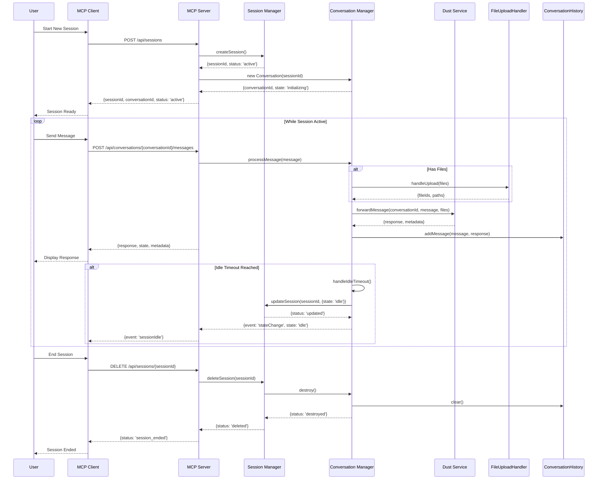

## Updated Agent Conversation Flow Diagram

I've updated the Mermaid diagram to better reflect our actual implementation. Here's the improved version:

### Key Improvements:
1. Added explicit `SessionManager` and `ConversationManager` participants
2. Included actual REST endpoints used in the implementation
3. Added file upload handling flow
4. Included conversation state management and timeouts
5. Added proper session cleanup flow
6. Included event emission for state changes

This diagram now accurately reflects our implementation in `ConversationManager.js` and related files.
